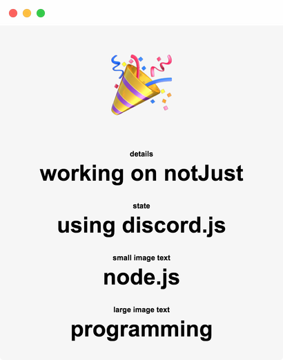

# EasyRPC

### EasyRPC is an Electron app for macOS, Windows, and Linux that allows users to easily set their Discord Rich Presence Status.

### It has a config for default strings, which can then be changed through the app at any time.

## Setup

1. Copy the file `config.json.example` to `config.json`
2. Just install all requirements by using `npm i`

## Usage

1. Make sure Discord is open and running, with no other Rich Presence currently set (check this by checking your own profile in the desktop app, there should be no "playing", "streaming", "watching", or "listening" status)
2. Open Terminal or a command line and go to the app's folder: `cd EasyRPC-master`
3. When you're in the folder, do `npm run start` to start the app. The app should open and focus
4. In the app, you'll see some default text. You can change the text shown on your Rich Presence by clicking and changing the text. These will update every 15 seconds.
5. Your rich presence should now be visible to you (via the desktop app) and any other users who look at your profile

## Customization

### Changing Default Text

1. Open `config.json` with a good text editor
2. Change `working on a bot`, `using discord.js`, and `node.js` to the text you'd like to show on your Rich Presence by default
3. Restart the app by doing Ctrl-C and `npm run start` again to see the new default text

### Changing Images

*Docs Coming Soon. For now, if you know how to upload the images, just change the `imageKeys` in `config.json`.*

## Thanks

Thanks to [devsnek](https://github.com/devsnek)'s original Rich Presence example for much of the base code used for EasyRPC.
