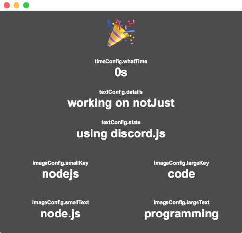

# SimplePresence
SimplePresence is an Electron app for macOS, Windows, and Linux that allows users to easily set their Discord Rich Presence Status.
It has a config for default strings, which can then be changed through the app at any time.

## Main
SimplePresence's main/normal usage is for a custom rich presence. It supports images, captions, timestamps, and regular text. Start off by [following the setup guide](https://github.com/justdotJS/SimplePresence/wiki/setup).

## Services
SimplePresence has support for many service integrations - get your currently playing song, video, or movie in your Rich Presence. We currently support:
- Apple Music
- FooBar2000
- Google Play Music
- IMDB
- lastFM
- Spotify
- YouTube

Get information on using these service [here](https://github.com/justdotJS/SimplePresence/wiki/Services) after following the [setup guide](https://github.com/justdotJS/SimplePresence/wiki/setup).

## Wiki
All instructions for setup, customization, and usage of SimplePresence are in our Wiki. [Press here to see it.](https://github.com/justdotJS/SimplePresence/wiki/)

## Thanks
Thanks to **[devsnek](https://github.com/devsnek)** for his original Rich Presence example, which helped with much of the base code used for EasyRPC.

Thanks to **Rung#9946** for the `Changing Images` section on the wiki.

Thanks to **Ardia#7038** for the initial FooBar2000 integration code and FooBar2000 setup page (on the wiki).
